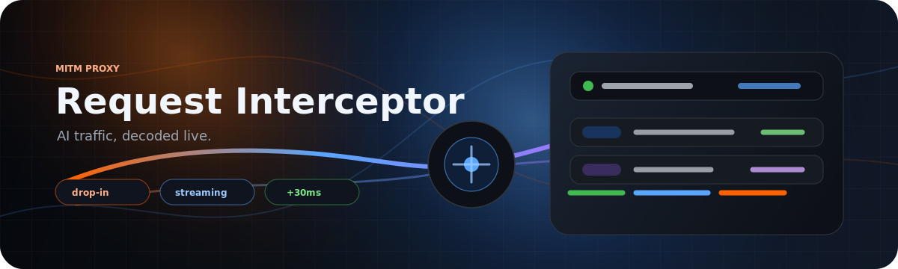
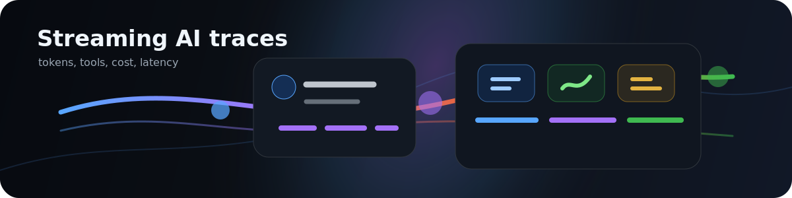
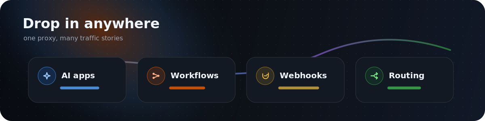
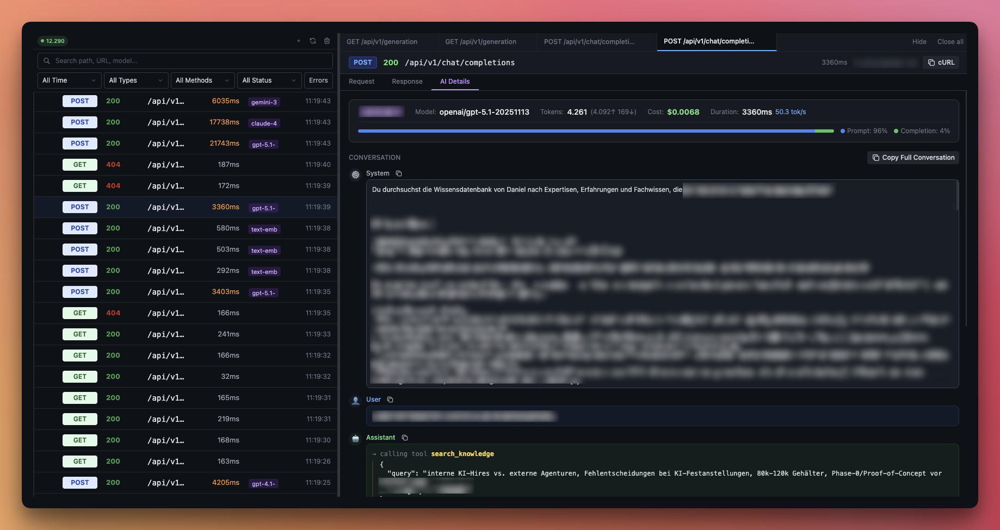

# Request Interceptor



**A self-hosted drop-in proxy for watching HTTP traffic as it happens - built especially for AI APIs, streaming responses, multimodal payloads, workflow builders, and webhook-heavy systems.**

Point any HTTP client at Request Interceptor instead of the real upstream. It forwards the request unchanged, captures request and response details, reconstructs streaming traffic, detects AI calls, and turns the trace into a live debugging dashboard.

Use it when you want a temporary man-in-the-middle debugging layer, a persistent monitoring layer in front of workflow automations, or a lightweight routing layer you can add without rewriting clients.



## Why It Exists

Modern AI and workflow systems are hard to inspect:

- LLM requests are large, nested, streamed, and often multimodal.
- Workflow builders like n8n make it easy to wire services together, but harder to see what actually moved over the wire.
- Webhooks fail quietly unless you capture headers, payloads, retries, latency, and upstream responses.
- Routing experiments usually require client changes, deployment changes, or both.

Request Interceptor sits in the middle and gives that traffic a memory.

## Highlights

| Capability | What it gives you |
| --- | --- |
| **Drop-in proxy** | Change the target URL or add `X-Target-URL`. No SDK wrapper, no client rewrite. |
| **Streaming-safe capture** | Server-Sent Events stay streamed to the client while timing and chunks are captured. |
| **AI-aware parsing** | Detects OpenAI, Anthropic, Azure OpenAI, OpenRouter, and OpenAI-compatible APIs. |
| **Multimodal handling** | Keeps large bodies, image/audio/file hints, tool calls, and request context readable. |
| **Low overhead** | Internal tests saw roughly **30ms added latency** on a small VPS. |
| **OpenRouter enrichment** | Uses OpenRouter generation metadata to fetch actual provider, usage, cost, cache discounts, and reasoning-token details. |
| **Agent traceability** | Groups shared system prompts, surfaces tool calls/results, and helps find related agent requests. |
| **Cost intelligence** | Shows expensive single requests, model/provider spend, cache savings, and prompt cache ratios. |
| **Live dashboard** | Requests stream in via Socket.IO with filters, tabs, cURL copy, AI dashboards, and cost views. |
| **Routing rules** | Route by query, header, path prefix, path regex, header regex, or default target. |

## Use Cases



### Debug AI apps without touching the app

Put the proxy in front of OpenAI, Anthropic, OpenRouter, or an OpenAI-compatible endpoint. You keep the client behavior, but gain a readable conversation view with:

- system prompts, user messages, assistant output, tool calls, and tool results
- prompt/completion/cached/reasoning tokens
- estimated and enriched cost
- streaming time-to-first-token and total duration
- multimodal request hints for images, audio, files, and large payloads

### Understand agent systems

Agent traces are messy because a single run can fan out into multiple model calls, tool calls, retrieval calls, and follow-up requests. Request Interceptor helps you work backwards from the traffic:

- cluster requests that share the same system prompt
- filter back to all calls from a prompt family
- inspect tool calls and tool results inline
- pin suspicious or expensive requests while you compare them
- search across paths, URLs, request bodies, and AI prompt content
- compare model, token, cost, and latency behavior across runs

It is especially useful when you need to answer questions like "which prompt variant got expensive?", "which tool call produced the bad state?", or "which request in this agent chain started streaming late?"

### Monitor embeddings, PDFs, and multimodal workloads

Embeddings and multimodal requests can become huge quickly. The proxy avoids turning the UI into a wall of vectors while still preserving useful context:

- embedding request kind detection
- input counts and short previews instead of full vector noise
- embedding dimensions from responses
- image, audio, video, and file content parts
- inline PDF/file previews when media is captured
- OpenRouter PDF parse annotations and file annotations

### Find caching and cost opportunities

Once AI traffic flows through the proxy, cost stops being a vague billing-page number. The AI dashboard shows:

- total spend over time
- top models and providers by cost
- most expensive single requests
- top system-prompt clusters by cost, tokens, and latency
- OpenRouter cache savings
- prompt cache ratio
- reasoning-token share

That makes it easier to spot prompts that should be cacheable, expensive agent loops, models that are doing too much reasoning, or workflows that quietly got more expensive.

### Compare OpenRouter upstream providers

For OpenRouter traffic, Request Interceptor enriches the captured request after the response using the Generation API. That adds the actual upstream provider and native usage details, so the dashboard can compare upstream providers by:

- request count
- token volume
- actual cost
- average latency
- error rate

That is useful when a model route looks fine at the OpenRouter level, but one underlying provider is slower, noisier, or more failure-prone than the rest.

### Add observability to n8n and workflow builders

Workflow tools are great at connecting systems, but debugging is often scattered across node executions and upstream logs. Route HTTP nodes through Request Interceptor and you get a single live traffic layer for:

- external API calls
- LLM calls inside automations
- webhook-to-API chains
- retry behavior and response timing
- future routing experiments without changing every node again

### Monitor webhook traffic

Use it between a webhook sender and your service to capture the full exchange:

- headers and body
- status code and latency
- failed deliveries
- large payloads
- redacted secrets after retention windows

### Build a lightweight routing layer

Start with observability, then add routing rules. Match traffic by path prefix, regex, or headers and forward each pattern to a different upstream. Per-request overrides still win, so you can mix rules with ad-hoc debugging.

## Quick Start

```bash
docker compose up -d
```

Two ports come up:

| Port | Purpose |
| --- | --- |
| `3100` | Admin dashboard and API |
| `3101` | Proxy endpoint for your clients |

Default login:

```text
admin / changeme
```

Change the credentials before exposing the dashboard.

## Route Your First Request

Every proxied request needs a target upstream. Pick the style that fits the caller.

### Query parameter

```bash
curl "http://localhost:3101/api/users?__target=https://api.example.com"
```

`__target` is stripped before forwarding.

### Header

```bash
curl "http://localhost:3101/api/users" \
  -H "X-Target-URL: https://api.example.com"
```

`X-Target-URL` is stripped before forwarding.

### Routing rules

Use the dashboard to define rules such as:

| Match | Target |
| --- | --- |
| `/v1/*` | `https://api.openai.com` |
| `/api/v1/*` | `https://openrouter.ai` |
| `/webhooks/*` | `https://internal.example.com` |

Priority order:

1. `__target` query parameter
2. `X-Target-URL` header
3. dashboard routing rules
4. default target URL

## Intercept An AI Call

```bash
curl "http://localhost:3101/v1/chat/completions" \
  -H "X-Target-URL: https://api.openai.com" \
  -H "Authorization: Bearer $OPENAI_API_KEY" \
  -H "Content-Type: application/json" \
  -d '{
    "model": "gpt-4o-mini",
    "stream": true,
    "messages": [
      { "role": "system", "content": "Be concise." },
      { "role": "user", "content": "Explain request tracing." }
    ]
  }'
```

The response still streams back to your client. In the dashboard, the request becomes a structured AI trace with timing, tokens, cost, messages, and raw request/response views.

## Dashboard



The dashboard is built for live debugging:

- live request list with pause, refresh, search, filters, and pinned requests
- tabbed request inspection without losing your place in the stream
- AI conversation view for chat, tool calls, tool results, embeddings, and multimodal requests
- request/response headers and body viewers
- cURL generation for replaying captured requests
- AI dashboard with aggregate spend, token counts, latency, models, providers, and top prompts
- top system-prompt clusters for agent and prompt-family analysis
- OpenRouter enrichment view for actual provider, native token counts, cache discounts, exact cost, provider latency, and provider error rate

## Configuration

Environment variables:

| Variable | Default | Description |
| --- | --- | --- |
| `PORT_ADMIN` | `3000` | Dashboard and admin API port inside the container |
| `PORT_PROXY` | `3001` | Proxy port inside the container |
| `TARGET_URL` | - | Default upstream when no target is specified |
| `ADMIN_USER` | `admin` | Basic auth username |
| `ADMIN_PASSWORD` | `changeme` | Basic auth password |
| `DATABASE_URL` | `file:/data/app.db` | SQLite database path |
| `LOG_RETENTION_DAYS` | `30` | Initial request-log retention in days. Can be changed later in Settings. |
| `AUTH_HEADER_RETENTION_DAYS` | `0` | Initial credential/header retention in days. `0` means redact immediately. Can be changed later in Settings. |
| `MEDIA_RETENTION_DAYS` | `30` | Initial media-file retention in days. Can be changed later in Settings. |
| `MEDIA_DIR` | `/data/media` | Storage path for extracted media blobs |

A single Docker volume at `/data` holds SQLite history and media storage.

## Data Hygiene

Request Interceptor is designed to help inspect traffic without turning your proxy into a secret graveyard.

- request logs, credentials, and extracted media have independent retention controls in Settings
- authorization headers, API keys, and cookies can be redacted immediately or after a short debugging window
- media retention can be shorter than request retention when files are heavier than the metadata you need
- the cleanup job runs hourly and uses the database config, with env vars as startup defaults
- admin API is protected by basic auth or optional Google OAuth
- admin API is rate-limited

## Docs

- [API reference](docs/API.md)
- [AI assistant guide](docs/AI_ASSISTANT_GUIDE.md)

## License

MIT

---

<sub>Built by [DPA+](https://dpa.plus)</sub>
